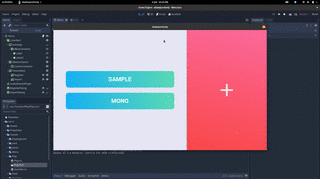

# :dancer: Shake Your Body!

### Read more @

+ [The game](./docs/game.md)
  + [How it works](./docs/game.md#how-it-works)
  + [Score](./docs/game.md#score)
  + [Sharing packed songs](./docs/game.md#sharing-packed-songs)
  + [Installation process](./docs/game.md#installation-process) [[[ todo ]]]
+ [Technologies](./docs/tech.md)
  + [OpenPose](./docs/tech.md#OpenPose)
  + [Processing, Python, Godot: a tale of engines](./docs/tech.md#game-engine)

### Us

We are a little and ever-changing group of students. We come from the robotics and computer science specialisations of the ITIS Mario Delpozzo. At the moment the team is:

+ Alessia De Giovannini -  :octocat: [@AleDegio](https://github.com/AleDegio)
+ Pietro Jomini -  :octocat: [@PietroJomini](https://github.com/PietroJomini)

### Thanks to

+ **IIT of Genoa**
+ **ITIS Mario Delpozzo**