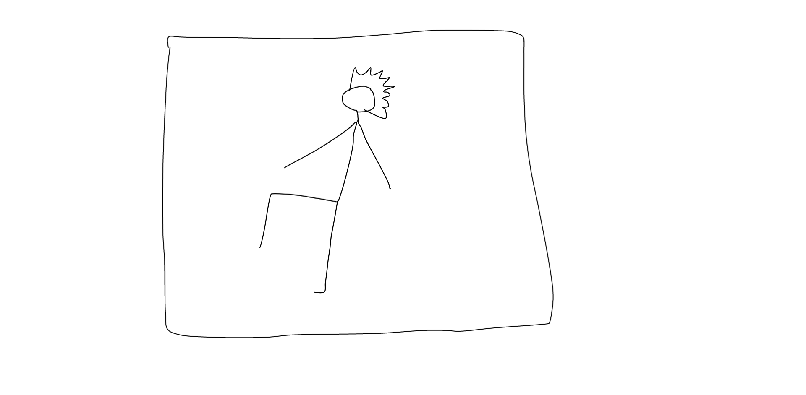
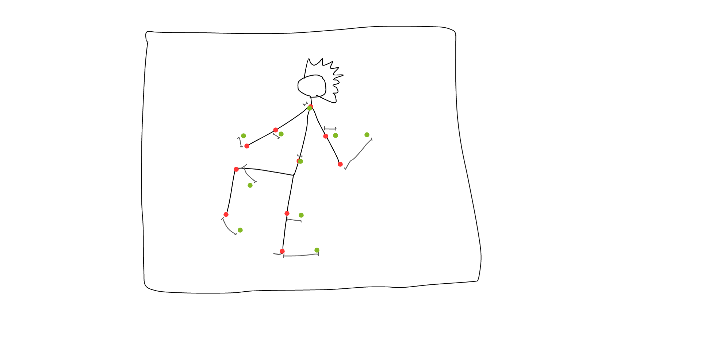

# Theoretical representation

We decided to represent a dance through a series of positions to be taken at certain times.

By checking the position of the joints of the player in these moments, we can determine the precision of his dance and consequently update the score

