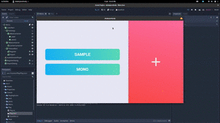
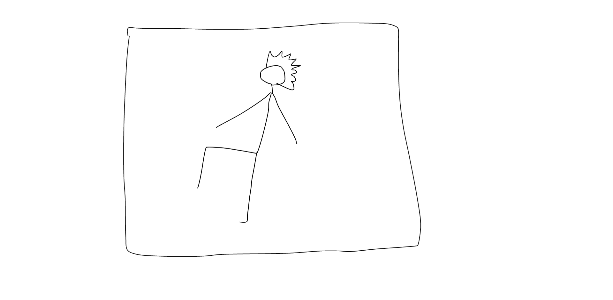
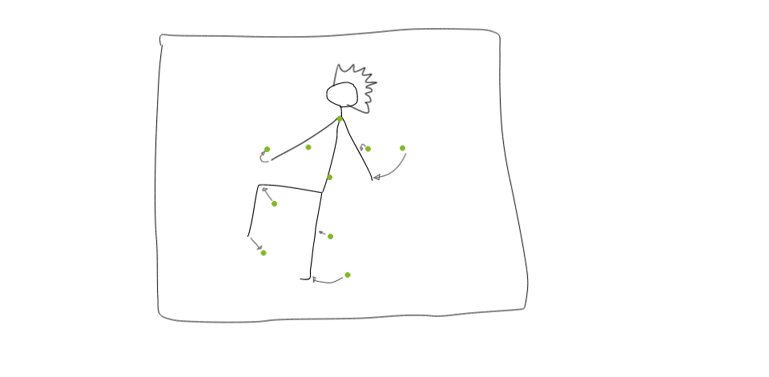
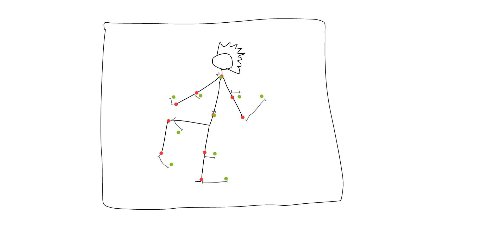

# :dancer: Shake Your Body: the Game

## How it works

We represent a dance through a series of potions to be taken at certain times

By checking the position of the joints of the player in these moments, we can determine the precision of his dance and consequently update the score

## Score

When we check the difference between the expected and real position, we categorise each joint in three categories: `HIT`, `NEARLY` & `MISS`, based on the linear distance between the joints.

We then modify accordingly the `score` and the `multiplier`. The score is given by the formula: `score = (score + modifier) * multiplier`.

The modifier change the score and the multiplier following this table:

|            | HIT  | NEARLY | MISS |
| ---------- | ---- | ------ | ---- |
| Multiplier | +0.1 | +1     | *0   |
| Score      | +1   | +0.5   | +0   |

## Sharing packed songs

We package songs & moves data as renamed `.zip` files: `.shyb`.

You can import them in the game and find the registered ones in your game folder.

## Installation process