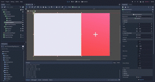

# :dancer: Shake Your Body: Technologies

## OpenPose

We utilise [openpose](https://github.com/CMU-Perceptual-Computing-Lab/openpose) to send joints data over an UDP socket, to retrieve them later in the game. The code for the `openpose user_code` can be found [here](https://github.com/shakeyourbody/openpose_client). 

## Game engine

We struggled with the choice of a proper game engine. At first we didn't even used an engine, trying to build by ourselves a little framework with the [processing python mode](https://py.processing.org/), and ended up giving up in favor of [arcade](https://arcade.academy/). Then we blew everything up again, due to the high time required to build on top of such a minimalist engine. 

So we finally made up our minds for [Godot engine](https://godotengine.org/), learned some c# and jumped into the world of the big engines.

The history of our unsuccessful attempt at using a minimalist engine can be found at [this branch](https://github.com/shakeyourbody/shakeyourbody/tree/old_python) 

